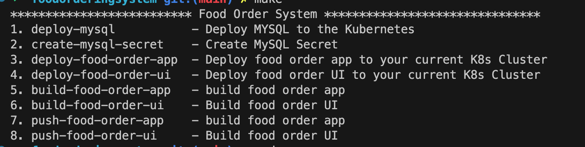
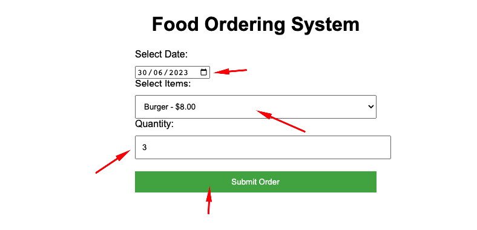
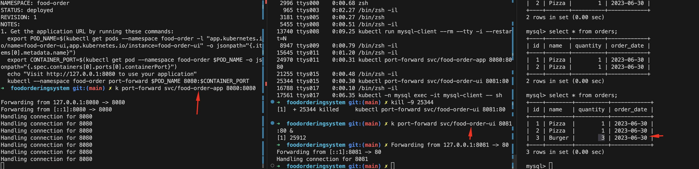

# Food Order System

* [Prerequisites](#prerequisites)
* [Initial Steps](#initial-steps)
* [Database Deployment](#database-deployment)
* [Food Order App Deployment](#food-order-app-deployment)
* [Food Order UI Deployment](#food-order-ui-deployment)
* [Test the Food Order Application](#test-the-food-order-application)
* [Food Order App Buid & Push to docker repository[Optional]](#food-order-app-buid-and-push-to-docker-repository)
* [Food Order UI Buid & Push to docker repository[Optional]](#food-order-ui-buid-and-push-to-docker-repository) 
* [Uninstall](#uninstall)
* [Verify Database & data](#verify-database-&-data)


### Prerequisites
Following tools are required to install the Food Order System.
1. Kubectl
2. Kubernetes cluster(e.g Kubeconfig pointing to any cloud Kubernetes e.g EKS , GKS, AKS or minimuke etc)
3. MYSQL client [optional]

### Initial Steps
 Clone the `foodorderingsystem` repository from GitHub to your local system, as shown below
```bash
  git clone git@github.com:Mshahidtaj/foodorderingsystem.git
  cd  foodorderingsystem
```
```
  make help
``` 
It will show the following commands menu




### Database Deployment

1. Install MYSQL Database as Container to the Kubernets
  ```bash
     make Deploy-MySQL     
  ```
2. Create MYSQL database Secret for Food Order Application
```bash
   make create-mysql-secret
```

### Food Order App Deployment
```bash
   make deploy-food-order-app
```

### Food Order UI Deployment
```bash
   make deploy-food-order-ui
```

### Test the Food Order Application
#### Start the Food Order APP & UI 
```
  make start-food-order-app-ui
```
#### Open the browser using the url "http://localhost:8081", as shown below
  
  


### Food Order App Buid and Push to docker repository
```bash
   make build-food-order-app
   make push-food-order-app
```

### Food Order UI Buid and Push to docker repository
```bash
   make build-food-order-ui
   make push-food-order-ui
```

### Uninstall 
```
  make uninstall-food-system
  make uninstall-mysql-db
```

### Verify Database & data
 1. Get the dataabse password
 ```
 MYSQL_ROOT_PASSWORD=$(kubectl get secret --namespace mysql mysql -o jsonpath="{.data.mysql-root-password}" | base64 -d)
``` 
 2. Run a pod that you can use as a client:
  ```
    kubectl run mysql-client --rm --tty -i --restart='Never' --image  docker.io/bitnami/mysql:8.0.33-debian-11-r17 --namespace mysql --env MYSQL_ROOT_PASSWORD=$MYSQL_ROOT_PASSWORD --command -- bash
  ```

 3. To connect to primary service (read/write):
```
    mysql -h mysql.mysql.svc.cluster.local -uroot -p"$MYSQL_ROOT_PASSWORD"
```

4. Misc SQL commands
```SQL
   Show databasees;
   use food-ordering;
   show tables;
   select * from menu;
   select * from orders;
```