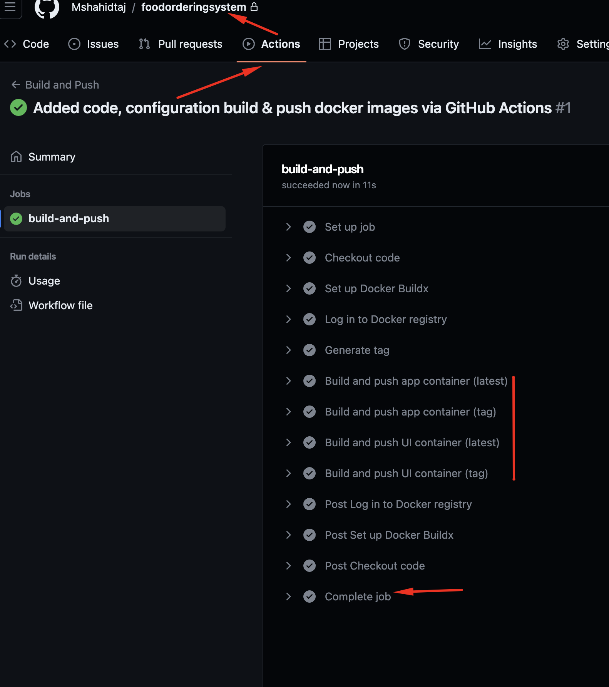

# Food Order System
* [Overview](#overview)
* [Prerequisites](#prerequisites)
* [Initial Steps](#initial-steps)
* [Database Deployment](#database-deployment)
* [Food Order App Deployment](#food-order-app-deployment)
* [Food Order UI Deployment](#food-order-ui-deployment)
* [CI and CD with GitHub Actions](#ci-and-cd-with-github-actions)
* [Test the Food Order Application](#test-the-food-order-application)
* [Food Order App Buid and Push to docker repository](#food-order-app-buid-and-push-to-docker-repository)
* [Food Order UI Buid and Push to docker repository](#food-order-ui-buid-and-push-to-docker-repository) 
* [Uninstall](#uninstall)
* [Verify Database and data](#verify-database-and-data)
* [Improvement](#improvement)


### Overview
This repository contains a small test project called the 'Food Order Application,' written in GoLang, with a simple UI. It consists of the following main components:
  1. Food App UI: This component is Dockerized and runs as a container.
  2. Food Middleware Application: This component is Dockerized and runs as a container.
  3. MYSQL database: The database is also running as a container and includes a persistent volume (PV).
  4. Kubernetes Cluster: The project can be deployed on a Kubernetes cluster, such as AKS, EKS, or a test Minikube setup."

### Prerequisites
Following tools are required to install the Food Order System.
1. Kubectl
2. Kubernetes cluster(e.g Kubeconfig pointing to any cloud Kubernetes e.g EKS , GKS, AKS or minimuke etc)
3. MYSQL client [optional]
4. Helm command line tool.

### Initial Steps
 Clone the `foodorderingsystem` repository from GitHub to your local system, as shown below
```bash
  git clone git@github.com:Mshahidtaj/foodorderingsystem.git
  cd  foodorderingsystem  
```
All building and deployment tasks are encapsulated within a Makefile to facilitate straightforward administration, `make help` command can be used show the available options, as shown below 
```
  make help
``` 
It will show the following commands menu


### Database Deployment

1. Install MYSQL Database as Container to the Kubernets
  ```bash
     make Deploy-MySQL     
  ```
2. Create MYSQL database Secret for Food Order Application
```bash
   make create-mysql-secret
```

### Food Order App Deployment
```bash
   make deploy-food-order-app
```

### Food Order UI Deployment
```bash
   make deploy-food-order-ui
```

### Test the Food Order Application
#### Start the Food Order APP & UI 
```
  make start-food-order-app-ui
```
#### Open the browser using the url "http://localhost:8081", as shown below
  
  

### CI and CD with GitHub Actions
  This project implements a CI/CD (Continuous Integration/Continuous Deployment) pipeline using GitHub Actions. The pipeline is responsible for building and deploying the application's Docker containers.

  ### Workflow: Build and Push Docker Images

  The `build-and-push.yml` workflow file in the `.github/workflows` directory defines the CI/CD pipeline. This workflow is triggered on every push to the `main` branch.

  The workflow performs the following steps:

  1. Checks out the repository code.
  2. Sets up Docker Buildx for multi-platform builds.
  3. Logs in to the Docker registry using the provided Docker credentials.
  4. Builds and pushes the latest version of the app container.
  5. Generates a tag for the app container based on the branch or commit.
  6. Builds and pushes the tagged version of the app container.
  7. Builds and pushes the UI container.

  

### Food Order App Buid and Push to docker repository 
[Optional, Only required if there is a new change in the code, which we want to deploy]
```bash
   make build-food-order-app
   make push-food-order-app
```

### Food Order UI Buid and Push to docker repository 
[Optional, Only required if there is a new change in the code, which we want to deploy]
```bash
   make build-food-order-ui
   make push-food-order-ui
```

### Uninstall 
```
  make uninstall-food-system
  make uninstall-mysql-db
```

### Verify Database and data
 1. Get the dataabse password
 ```
 MYSQL_ROOT_PASSWORD=$(kubectl get secret --namespace mysql mysql -o jsonpath="{.data.mysql-root-password}" | base64 -d)
``` 
 2. Run a pod that you can use as a client:
  ```
    kubectl run mysql-client --rm --tty -i --restart='Never' --image  docker.io/bitnami/mysql:8.0.33-debian-11-r17 --namespace mysql --env MYSQL_ROOT_PASSWORD=$MYSQL_ROOT_PASSWORD --command -- bash
  ```

 3. To connect to primary service (read/write):
```
   mysql -h mysql.mysql.svc.cluster.local -uroot -p"$MYSQL_ROOT_PASSWORD"
```

4. Misc SQL commands
  ```SQL
   Show databasees;
   ```

   ```
   use food-ordering;
   ```

   ```
   show tables;
   ```

   ```
   select * from menu;
   select * from orders;
  ```

### Improvement
  1. Add continueos deployment feature to Kubernetes e.g using GitOPS stratetgy (tools Flux / Argocd)
  2. Add Ingress controller like `Nginx` & ingress resource for `Food Order App UI` with TLS secret to support `HTTPS`
  3. Consider Security features for UI ingress like putting WAF e.g Cloudflare , Azure WAF or AWS Sheild etc
  4. Add unit Test coverage